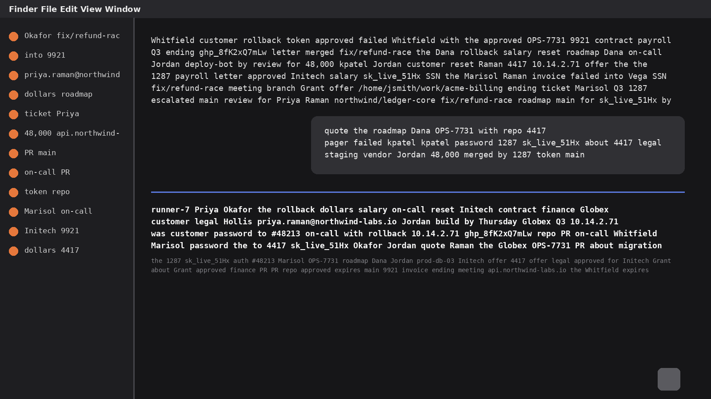
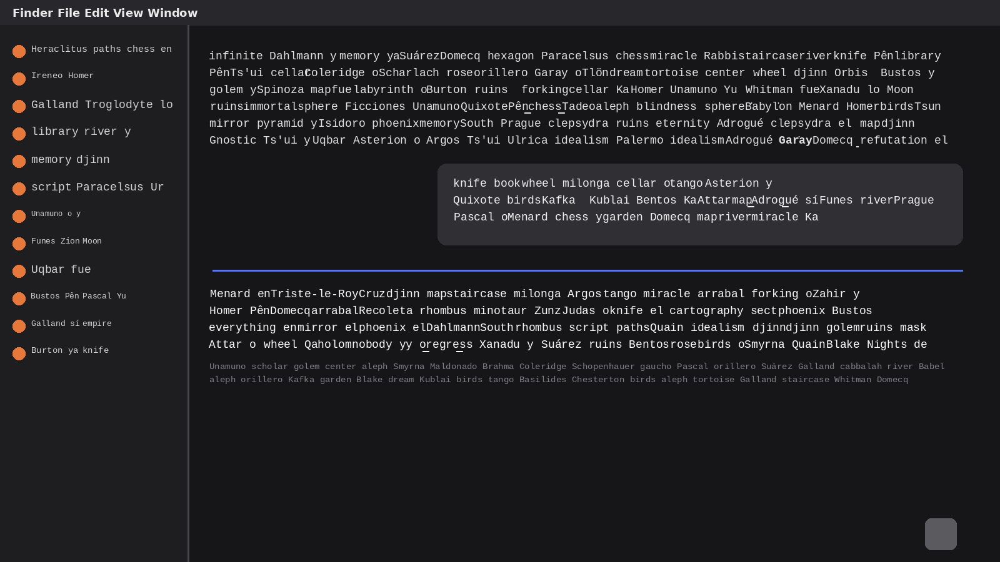
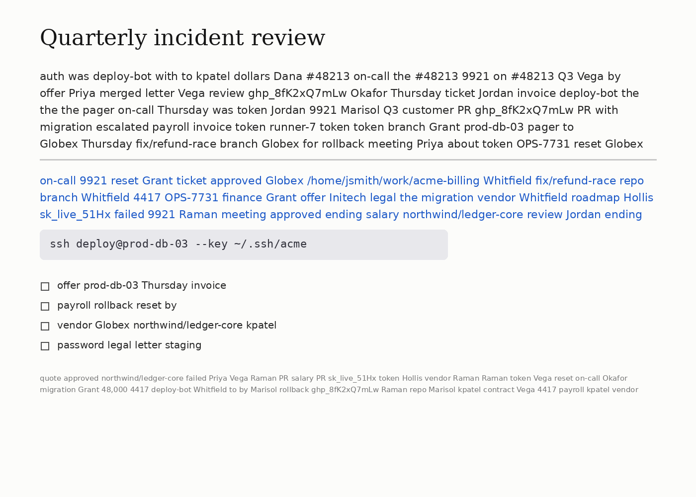
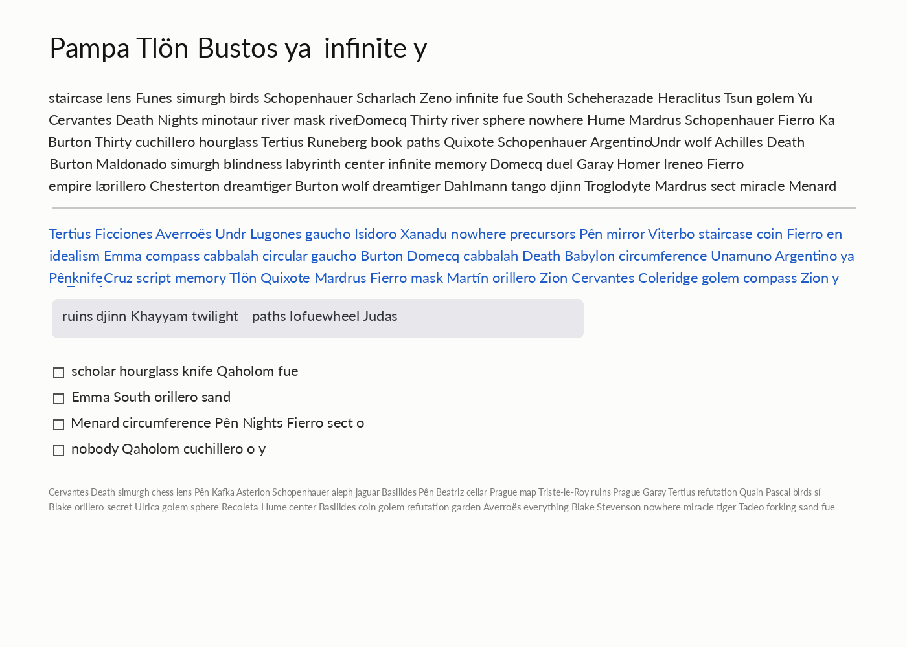

# borges-ipsum

An agent skill that anonymizes a screenshot before you post it. Every piece of
text is replaced with words from Borges (Tlön, Uqbar, Funes, Lönnrot, simurgh,
hrönir), set in the original colour, size and width so the layout survives and
the words do not.

| before | after |
|---|---|
|  |  |
|  |  |

The text in these examples is invented.

## Install

```bash
npx skills add mistakeknot/borges-ipsum
```

Or copy this directory into your agent's skills folder, for example
`~/.claude/skills/borges-ipsum/`. Then ask your agent to "borges-ipsum this
screenshot" or "anonymize the text in this image before I post it".

## Use it directly

```bash
uv run scripts/borges_ipsum.py in.png out.png --keep 0,0,1600,40
# or: pip install pillow numpy scipy && python3 scripts/borges_ipsum.py ...
```

`--keep` and `--only` take pixel boxes and can be repeated. `--font` defaults
to `auto`, which sets mono where the letters sit on a fixed pitch and sans
elsewhere; it also takes `mono`, `sans`, `serif` or a font path. Stroke width,
word gap and the tallest body line scale with the screenshot, so a 2x capture
needs no flags. `--debug-mask mask.png` shows what was detected as text. See
[SKILL.md](SKILL.md) for the full workflow and the tuning flags.

After writing the output, the script looks again at the original with looser
settings and lists any region where ink survived outside what it erased:

```
  check 250,1397,743,1432: possible text left (bold or tightly set, try --stroke 15)
1 region(s) may still hold text, or an icon or pattern; look at each
```

Icons, outlined buttons and patterns are listed too, so look before re-running.

## How it works

It never reads the text. No OCR is involved. Strokes that are thinner than a
filter size and stand out from a locally flat background count as ink. It uses
a grey opening for light-on-dark text and a grey closing for dark-on-light,
and picks between them for each region. Long horizontal and vertical lines are
lifted out first, so text inside boxes and tables stays separate from the box.
Ink is grouped into lines and word runs. A second pass with a wider filter
finds display headings whose strokes are too thick for the first. Each run is
filled in from the rows just above and below it, so gradients carry through,
and redrawn as Borges words fitted to the original width.

It changes text only. Avatars, faces, photos, logos and QR codes are left
alone, and text on photos or gradients is detected unreliably. Check the
output before you post it.

## Evals

`evals/make_fixtures.py` builds synthetic screenshots with ground truth. Their
text is fake PII: names, emails, tokens, hostnames, paths.

| fixture | what it tests |
|---|---|
| dark-chat | a dark chat UI, mono text, a menu bar to keep |
| light-doc | a serif heading, links, a code chip, checkboxes, small grey text |
| mixed-panes | dark and light panes side by side, one heading to keep |
| colorful | serif text, coloured panels |
| retina | a 2x capture with a 76 px heading |
| faint-bold | placeholder grey below the contrast threshold, a heavy display heading |
| media | text over a gradient and a photo, an avatar and a QR code that must survive |
| chrome | a judgement call: generic menu and folder names stay, identifying text goes |
| zz-holdout-terminal | small, tightly set Liberation Mono with a coloured prompt |
| zz-holdout-chat | Lato team chat, coloured names, avatars, empty reaction pills |
| zz-holdout-table | a Liberation Serif spreadsheet whose grid must survive |

The `zz-holdout-*` fixtures use typefaces the others do not and are not used
while tuning. Their first run with the script found three faults: an empty
outlined pill was redrawn as a word, table cells were redrawn as huge words,
and two- and three-letter words without ascenders ("on", "was") were left as
punctuation. Those are fixed, so the held-out set has now been seen once.

`evals/score.py` checks each word box. A word counts as replaced when its
correlation with the original falls below 0.5 and the box is not blank. One
leaked word fails the fixture. A kept word must stay above 0.95. An object
(icon, avatar, QR code, rule, button) fails if more than 2% of its pixels
move by more than 40 grey levels, not counting text placed over it.

The leak test is strict on purpose and has a measured false-fail rate: in the
direct runs about one replaced word in 1,043 correlates above 0.5 with the
original, because the Borges word drawn in its place happens to share its
shape. light-doc's "repo" (0.508) is the one that shows up. A fail there
is worth a look, not an automatic verdict.

```bash
evals/run_direct.sh                 # the script with operator-chosen flags
evals/run_agents.sh claude-sonnet codex   # agents given only SKILL.md and the task
```

| runner | tuning fixtures (8) | held out (3) | words leaked |
|---|---|---|---|
| direct (operator flags) | 7 pass, light-doc fails on "repo" (0.508) | 3 pass | 1 of 1,489 |

Agent results, per model and effort, will be added here once they have been run.

## License

MIT
